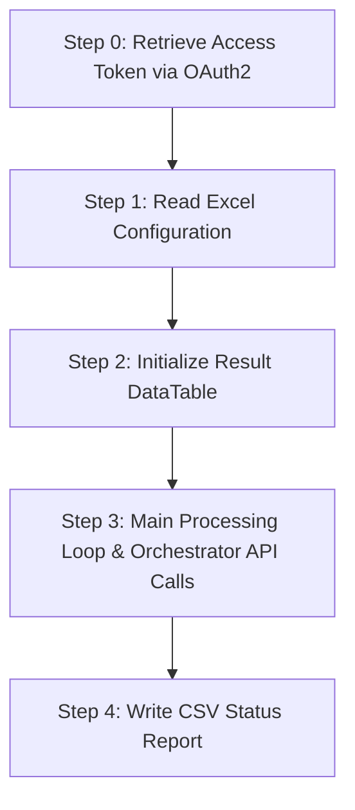

# UiPath Time Trigger Creation Workflow Documentation

This project automates reading configurations from the Excel file `Input_Triggers.xlsx`, translating these configurations into valid Cron expressions, and then invoking the UiPath Orchestrator API to create time triggers.

## 📌 Core Workflow Activities (`Main.xaml`)

The workflow is structured sequentially as follows:

---

### Step 0: Retrieve Access Token via OAuth2 (`Invoke Code`)
- **Activity**: `Invoke Code`
- **Function**: Sends a `POST` request with `FormUrlEncodedContent` to the UiPath Cloud Identity Token endpoint: `https://cloud.uipath.com/identity_/connect/token`.
- **InArguments**: `ClientId`, `ClientSecret`, `Scopes`.
- **OutArguments**: Extracts the `access_token` for authorization header.

### Step 1: Read Excel Configuration (`Read Range`)
- **Main Activities**:
  1. `Excel Process Scope` (`ueab:ExcelProcessScopeX`): Configures the Excel execution environment.
  2. `Use Excel File` (`ueab:ExcelApplicationCard`): Points to the Excel file `Input_Triggers.xlsx`.
  3. `Read Range` (`ueab:ReadRangeX`): Reads data from Sheet1 into a `DataTable` named `dt_TriggersInput`.
- **Key Feature**: Explicitly converts range expressions into strings using `Option Strict On` compatible syntax.

### Step 2: Initialize Result DataTable (`Invoke Code`)
- **Activity**: `Invoke Code`
- **Function**: Initializes an empty `DataTable` with 3 columns: `TriggerName`, `Status`, `Message` to trace the processing status of each row.

### Step 3: Main Processing Loop & Orchestrator API Calls (`Invoke Code`)
- **Activity**: `Invoke Code`
- **Function**: Iterates through each row in `dt_TriggersInput` and processes as follows:
  1. **Get `ReleaseId`**: Queries the `Releases` endpoint filtering by process name to locate the exact ID.
  2. **Calculate Cron**: Parses `Time`, `Frequency`, and `Weekdays` columns to construct a valid CRON expression.
  3. **Create directly via API**: For every row, it sends a `POST` request directly to the `/odata/ProcessSchedules` endpoint. Triggers with the same name are successfully allowed by the API or managed directly.
- **Payload Specifications**: 
  - Required fields: `Name`, `ReleaseId`, `StartStrategy: 1`, `StartProcessCron`, `StartProcessCronDetails: "{}"`, `TimeZoneId: "Korea Standard Time"`, `Enabled: true`.

### Step 4: Write CSV Status Report (`Invoke Code`)
- **Activity**: `Invoke Code`
- **Function**: Reads the result `DataTable`, formats it as a valid CSV string, and writes the output directly to `Trigger_Report.csv`.
